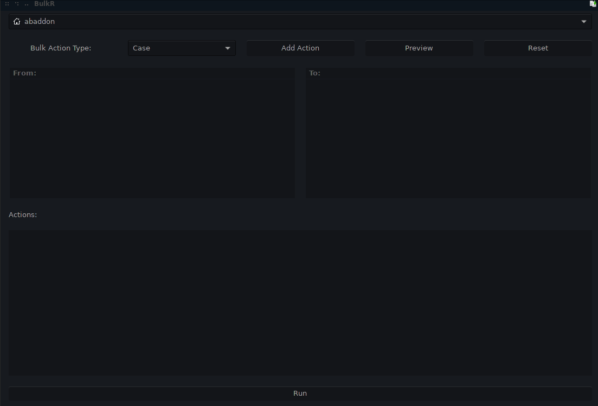
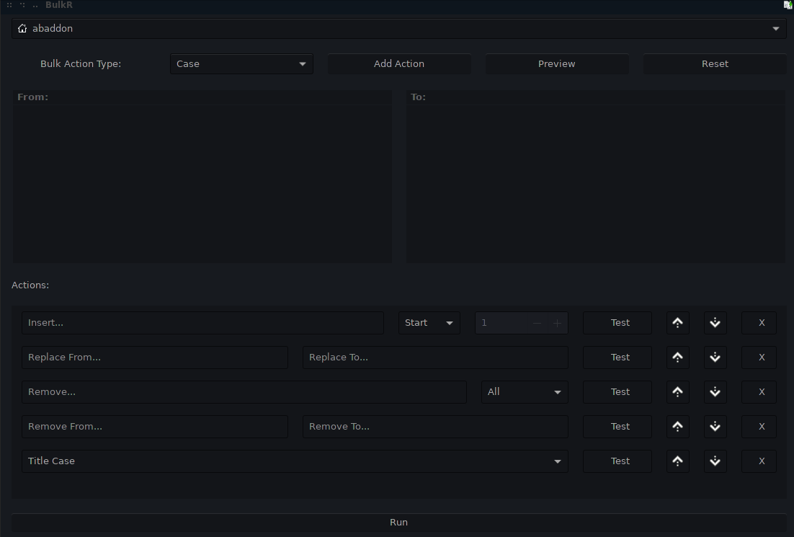

# BulkR
Bulk renaming utility written with python and Gtk.

# Notes


<h6>Install Setup</h6>
```
sudo apt-get install python3.8 python3-setproctitle python3-gi
```

# TODO
<ul>
<li>Add logic for stub instances.</li>
</ul>

# Images


